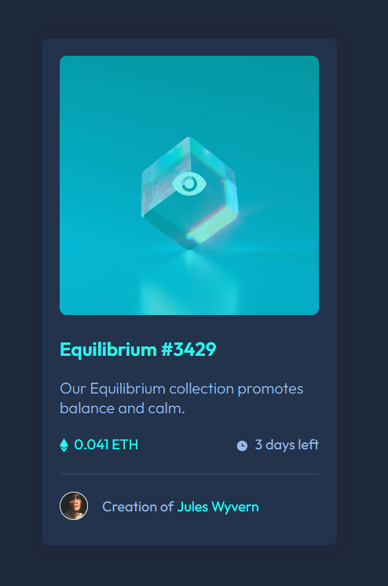

# Frontend Mentor - NFT preview card component solution

This is a solution to the [NFT preview card component challenge on Frontend Mentor](https://www.frontendmentor.io/challenges/nft-preview-card-component-SbdUL_w0U). Frontend Mentor challenges help you improve your coding skills by building realistic projects. 

## Table of contents

- [Overview](#overview)
  - [The challenge](#the-challenge)
  - [Screenshot](#screenshot)
  - [Links](#links)
- [My process](#my-process)
  - [Built with](#built-with)
- [Author](#author)

**Note: Delete this note and update the table of contents based on what sections you keep.**

## Overview

### The challenge

- Build out the project to the designs provided

### Screenshot

Hover State:

### Links

- Solution URL: (https://github.com/CHarvey820/nft-preview-card-component-main)
- Live Site URL: (https://charvey820.github.io/nft-preview-card-component-main)

## My process

### Built with

- CSS custom properties
- Flexbox

## Author

- GitHub - [CHarvey820](https://github.com/CHarvey820)
- Frontend Mentor - [CHarvey820](https://www.frontendmentor.io/profile/CHarvey820)